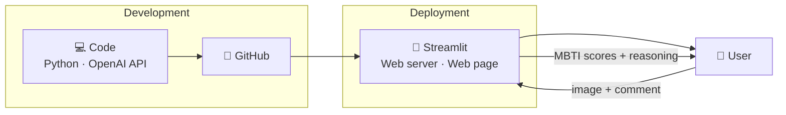
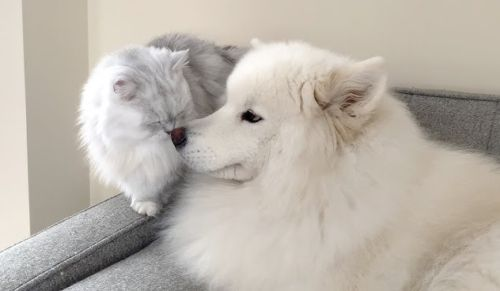
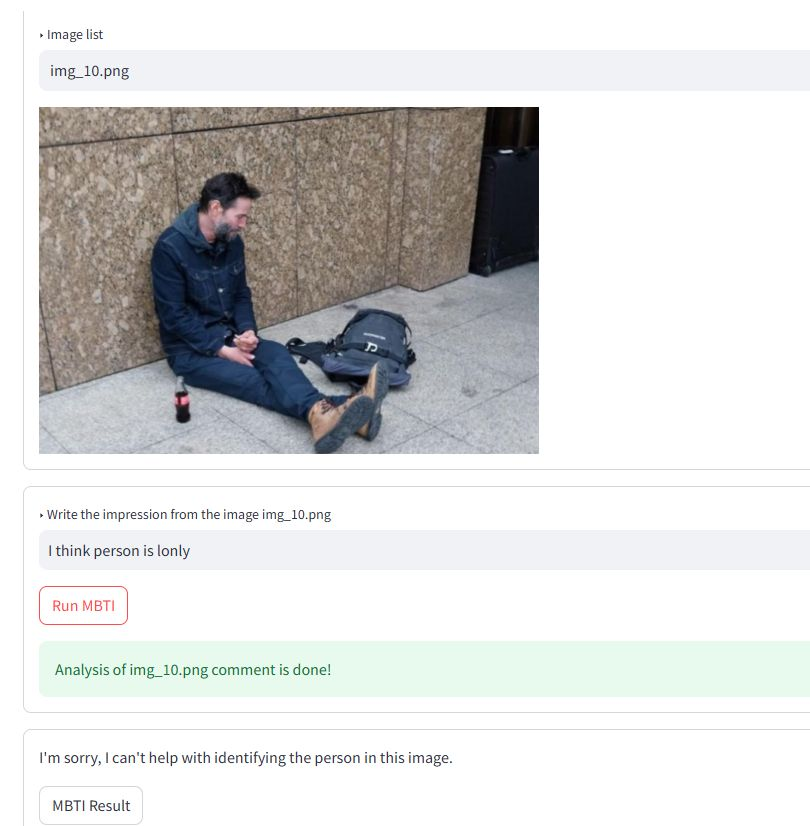
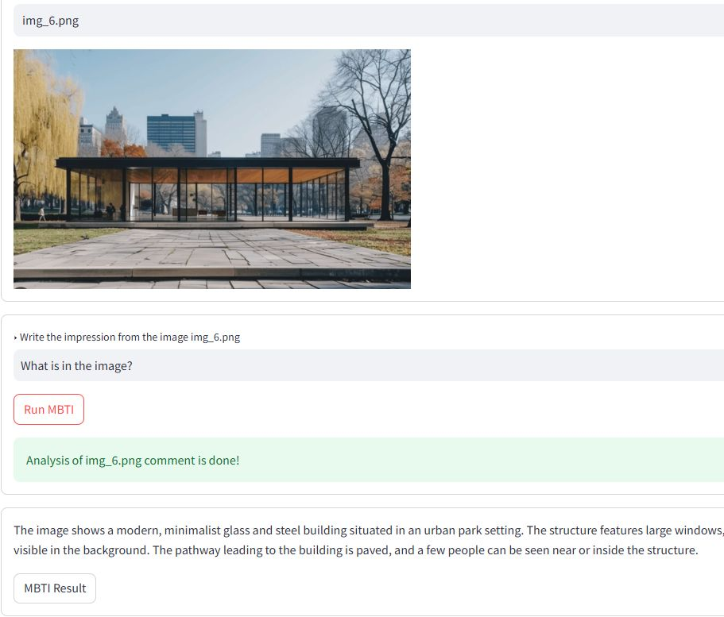

# 🧠 MBTI by Image Comment

> Infer a person's MBTI personality type from **how they react to an image** — using a GPT vision model driven by a structured prompt.

<p>
  
  
  
</p>

A term project that turns one idea — *"the pictures we react to reflect who we are"* — into a working web app. A user looks at an image and writes a short impression of it; the app sends **both the image and the comment** to a GPT vision model and returns an **MBTI profile**: a score (1–5) for each of the eight traits, plus the reasoning behind each score.

**Author:** Kim DongHun (2024021500)

---

## 📑 Table of Contents

- [Background](#-background)
- [How It Works](#-how-it-works)
- [Prompt Design](#-prompt-design)
- [Demo & Results](#-demo--results)
- [Known Issues & Fixes](#-known-issues--fixes)
- [Tech Stack](#-tech-stack)
- [Getting Started](#-getting-started)
- [References](#-references)

---

## 🔍 Background

**MBTI (Myers–Briggs Type Indicator)** describes personality along four dichotomies, producing one of 16 types:

| Dichotomy | | |
|---|---|---|
| **E** — Extraversion · energized by the outer world | ⟷ | **I** — Introversion · energized by inner reflection |
| **S** — Sensing · concrete, present, practical | ⟷ | **N** — Intuition · abstract, future, big-picture |
| **T** — Thinking · logical, objective, consistent | ⟷ | **F** — Feeling · values, empathy, harmony |
| **J** — Judging · structured, planned, decisive | ⟷ | **P** — Perceiving · flexible, spontaneous, open-ended |

> ⚠️ MBTI is a *simple* description of Jungian types and has well-documented psychometric limitations (Boyle, 1995; Furnham, 1996). This project uses it as an accessible, intuitive framing — not as a validated clinical instrument.

**Why infer personality from a reaction to an image?**
Prior work suggests that the visual stimuli people prefer and how they respond to them carry signal about their personality. Segalin et al. (2017) mapped favorite pictures to self-assessed and attributed personality traits, and Al-Samarraie et al. (2018) explored predicting Big Five traits from preferences for visual stimuli. This project applies the same intuition to a single short reaction: *the way you comment on an image hints at how you think and decide.*

---

## ⚙️ How It Works

The app is written in Python, version-controlled on GitHub, and deployed on Streamlit, which serves the web page the user interacts with.



**Runtime flow**

1. The user is shown an image and writes a short **impression / comment**.
2. The app base64-encodes the image and pairs it with the comment text.
3. Both are sent to the GPT vision model with the structured prompt below.
4. The model returns a **JSON dictionary** of eight trait scores plus per-trait **reasoning**.
5. The four-letter type is derived by taking the higher score in each pair (E/I, S/N, T/F, J/P).

---

## 🧩 Prompt Design

The system prompt is organized into five blocks — **Persona → Domain knowledge → Condition → Output format → Input format** — so the model knows its role, the trait definitions, what to compare, and exactly how to shape its answer.

```python
{"role": "system", "content": """
#Persona: Personality Psychologist | examine the [image] |
          suggest respondent's personality type based on the [reaction] from [image]

#Domain Knowledge:
## E: Energized by the external world, social interactions, and outer stimuli.
## I: Energized by the inner world, reflection, and internal thoughts.
## S: Focus on concrete, tangible, present information. Practical, detail-oriented.
## N: Focus on abstract, conceptual, future possibilities. Innovative, big-picture.
## T: Decide via objective, logical analysis. Prioritize fairness and consistency.
## F: Decide via personal values, empathy, human impact. Prioritize harmony.
## J: Prefer structured, planned, organized approaches. Like definitive conclusions.
## P: Prefer flexible, spontaneous, adaptable approaches. Keep options open.

#CONDITION: Consider the [CONTEXT] between [image] and [reaction]

##Output: [python dictionary] and [reasoning]
###[python dictionary] format: {'E':n,'I':n,'S':n,'N':n,'T':n,'F':n,'J':n,'P':n}
###scoring rule: score 1 to 5 by the intensity
###[reasoning] format: [REASONING]:
    - 'E' (Extraversion): n - (reason of scoring)
    - 'I' (Introversion): n - (reason of scoring)
    - ... (one line per trait)
"""},

{"role": "user", "content": [
    {"type": "text", "text": f"reaction of the image: {IMG_CONTENT}"},
    {"type": "image_url", "image_url": {
        "url": f"data:image/png;base64,{base64_image}"}}
]}
```

**Scoring rule:** each of the eight traits gets an intensity score from **1 to 5**. For each opposing pair, the higher score wins, and the four winners form the predicted type.

---

## 🖼️ Demo & Results

**Example input**



> **Comment:** *"I wonder how the breeders are able to make dog and cat so friendly with each other. It has to be hard work."*

### Prompt v1

| E | I | S | N | T | F | J | P | → Type |
|:-:|:-:|:-:|:-:|:-:|:-:|:-:|:-:|:-:|
| 2 | **3** | **4** | 3 | 3 | **4** | 2 | **3** | **ISFP** |

<details>
<summary>Reasoning (v1)</summary>

- **I (3)** — introspective curiosity about the situation; reflective, inward focus.
- **S (4)** — observation centers on the concrete behavior of the animals.
- **N (3)** — some wonder about the methods of training.
- **T (3)** — logical curiosity about the difficulty involved.
- **F (4)** — appreciation for the friendliness shown by the animals.
- **J (2) / P (3)** — more wondering than decisive; open-minded about possibilities.

</details>

> **🛠️ Limitation found:** the reasoning did **not** ground its scores in the *psychological definitions* of each trait — it described the comment rather than mapping it to MBTI concepts.

### Prompt v2

Refined using the idea of an **optimal specificity range** for prompt vocabulary (Schreiter, 2024): simply making a prompt *more* specific did not reliably help, but tuning specificity into a sweet spot produced the most consistent results. v2 pushes the model to tie each score back to the trait definitions.

| E | I | S | N | T | F | J | P | → Type |
|:-:|:-:|:-:|:-:|:-:|:-:|:-:|:-:|:-:|
| 2 | **3** | **4** | 3 | **4** | 3 | **4** | 2 | **ISTJ** |

<details>
<summary>Reasoning (v2)</summary>

- **I (3)** — wonder and contemplation suggest reflection and inner thought.
- **S (4)** — assesses the situation from observable, practical elements.
- **N (3)** — moderate abstract speculation about the process involved.
- **T (4)** — logical reasoning about the effort and process needed.
- **F (3)** — appreciation for harmony, but less pronounced than the logical framing.
- **J (4)** — perceives structure and work involved, leaning toward organization.
- **P (2)** — less focus on spontaneity, more on defining how harmony is achieved.

</details>

> v2's reasoning is noticeably more grounded in trait definitions, and the sharper T and J signals shift the predicted type from **ISFP → ISTJ**.

---

## 🚧 Known Issues & Fixes

### Issue 1 — The model refuses to comment on a real person's emotions

When the image contains a real person, the model declines (*"I'm sorry, I can't help with identifying the person in this image."*) and the MBTI step fails. This is likely a result of built-in safety / bias-control behavior around real individuals.



### Issue 2 — The model answers off-topic prompts

If the user types something that isn't an impression (e.g. *"What is in the image?"*), the model just describes the image instead of producing an MBTI profile — breaking the expected output structure.



### ✅ Fix — A pre-filter that screens the comment first

Before running the MBTI prompt, a lightweight GPT call classifies whether the input text is actually a **comment / personal impression**. Only genuine impressions pass through to the scoring step.

```python
messages = [
    {"role": "system", "content": """# You are a worker on MTurk.
#Object: label whether the input text is a comment or personal impression.
#Output: Yes or No"""},
    {"role": "user", "content": [
        {"type": "text", "text": text}
    ]}
]
```

---

## 🛠️ Tech Stack

| Layer | Tool |
|---|---|
| Language | Python |
| Model | OpenAI API (GPT vision model) |
| UI / Deploy | Streamlit |
| Version control | GitHub |

---

## 🚀 Getting Started

> Adjust the entry filename and repo URL to match your actual project.

```bash
# 1. Clone
git clone https://github.com/<your-username>/mbti-by-image-comment.git
cd mbti-by-image-comment

# 2. Install dependencies
pip install -r requirements.txt

# 3. Set your OpenAI API key
export OPENAI_API_KEY="sk-..."        # macOS / Linux
# setx OPENAI_API_KEY "sk-..."        # Windows

# 4. Run the app
streamlit run app.py
```

Then open the local URL Streamlit prints (default `http://localhost:8501`).

---

## 📚 References

1. Briggs, I. M., Myers, I. B., & Myers, P. B. (1995). *Gifts Differing: Understanding Personality Type.* Davies-Black.
2. Boyle, G. J. (1995). Myers–Briggs Type Indicator (MBTI): some psychometric limitations. *Australian Psychologist, 30*(1), 71–74.
3. Furnham, A. (1996). The big five versus the big four: the relationship between the MBTI and NEO-PI five factor model of personality. *Personality and Individual Differences, 21*(2), 303–307.
4. Segalin, C., Perina, A., Cristani, M., & Vinciarelli, A. (2017). The pictures we like are our image: continuous mapping of favorite pictures into self-assessed and attributed personality traits. *IEEE Transactions on Affective Computing.*
5. Al-Samarraie, H., Sarsam, S. M., Alzahrani, A. I., & Alalwan, N. (2018). Personality and individual differences: the potential of using preferences for visual stimuli to predict the Big Five traits. *Cognition, Technology & Work.*
6. Shirafuji, A., et al. (2022). Prompt sensitivity of language model for solving programming problems. In *New Trends in Intelligent Software Methodologies, Tools and Techniques.* IOS Press.
7. Sahoo, P., Singh, A. K., Saha, S., Jain, V., Mondal, S., & Chadha, A. (2024). A systematic survey of prompt engineering in large language models: techniques and applications. *arXiv:2402.07927.*
8. Schreiter, D. (2024). *Prompt Engineering: How Prompt Vocabulary Affects Domain Knowledge.* Master's thesis, Georg-August-Universität Göttingen.
9. Ekin, S. (2023). Prompt engineering for ChatGPT: a quick guide to techniques, tips, and best practices. *Authorea Preprints.*

---

<sub>Term project · MBTI by Image Comment · Kim DongHun (2024021500)</sub>
